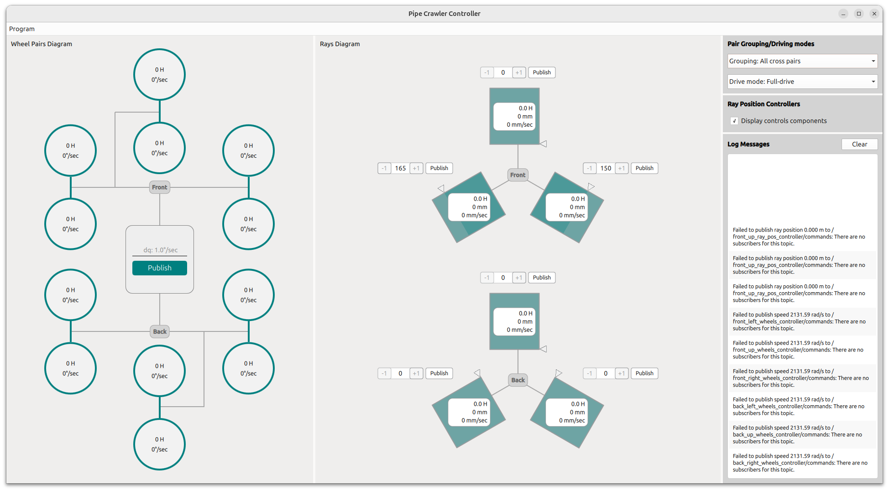

# pipe-crawler-controller

ROS2 Jazzy + Qt6 QML control panel for a pipe inspection robot (6 wheel pairs, 6 rays).

UI will be made by using [hypengw/QmlMaterial](https://github.com/hypengw/QmlMaterial) (Material Design 3, MIT) via `import Qcm.Material as MD`.



## Requirements

- ROS2 Jazzy
- **Qt 6.8+** (Qt 6.8 / 6.9 / 6.10+; system packages or a Qt install on `CMAKE_PREFIX_PATH`)
- [Git LFS](https://git-lfs.com) (icon fonts in QmlMaterial)
- CMake ≥ 3.20, Ninja (recommended for the QmlMaterial install script; Make is used if Ninja is absent)

## Working with the package

1. **Clone** (with submodule + LFS)

    ```bash
    cd ~/ros2_ws/src
    git clone --recurse-submodules https://github.com/simonoffcc/pipe-crawler-controller.git
    cd pipe-crawler-controller
    git lfs install && git lfs pull
    ```

    If you already cloned without submodules:

    ```bash
    git submodule update --init --recursive
    git lfs pull
    ```

2. **Install QmlMaterial once** (prefix outside the ROS workspace)

    ```bash
    ./scripts/install_qml_material.sh
    ```

    Default install prefix: `$HOME/opt/qml_material`  
    Default build dir: `$HOME/.cache/pipe-crawler/qml_material-build`

    Cleaning `ros2_ws/{build,install,log}` does **not** require reinstalling QmlMaterial. Re-run the script only after updating the submodule pin (`--force` if the stamp already matches).

    Optional: `PCC_BUNDLE_QML_MATERIAL=ON` builds QmlMaterial via `add_subdirectory` (CI / one-off stands). Not the default.

3. **Build**

    ```bash
    source /opt/ros/jazzy/setup.bash
    cd ~/ros2_ws
    colcon build --packages-select pipe_crawler_controller
    ```

    CMake looks for QmlMaterial under `$QML_MATERIAL_PREFIX` or `$HOME/opt/qml_material`.
    `source install/setup.bash` also prepends the QmlMaterial lib dir to `LD_LIBRARY_PATH`.

4. **Run**

    ```bash
    cd ~/ros2_ws
    source install/setup.bash
    ros2 run pipe_crawler_controller pipe_crawler_controller_node
    ```

    Optional telemetry smoke: `scripts/joint_state_publisher_tester.py`

## License notes

- This package: see `package.xml`
- QmlMaterial (third-party UI): MIT — see `3rdparty/qml_material/LICENSE`
