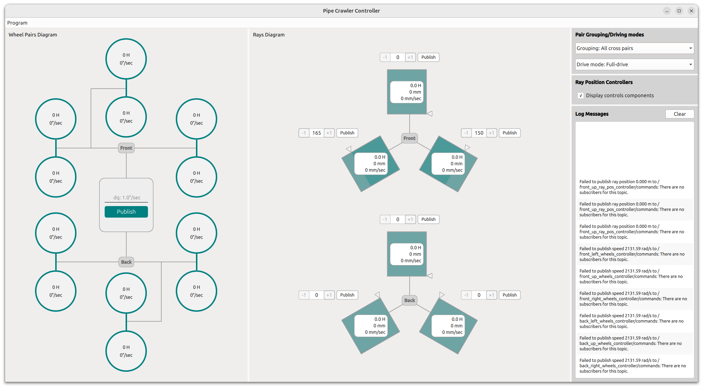

# pipe-crawler-controller

>ROS2 Jazzy + Qt6 QML control panel for a pipe inspection robot (6 wheel pairs, 6 rays).



### Requirements

- ROS2 Jazzy
- Qt ≥ 6.8

### Clone

```bash
source /opt/ros/jazzy/setup.bash
mkdir -p ~/ros2_ws/src
cd ~/ros2_ws/src
git clone https://github.com/simonoffcc/pipe-crawler-controller.git
```

### Build

```bash
colcon build --packages-select pipe_crawler_controller
```

### Run

```bash
source install/setup.bash
ros2 run pipe_crawler_controller pipe_crawler_controller_node
```
